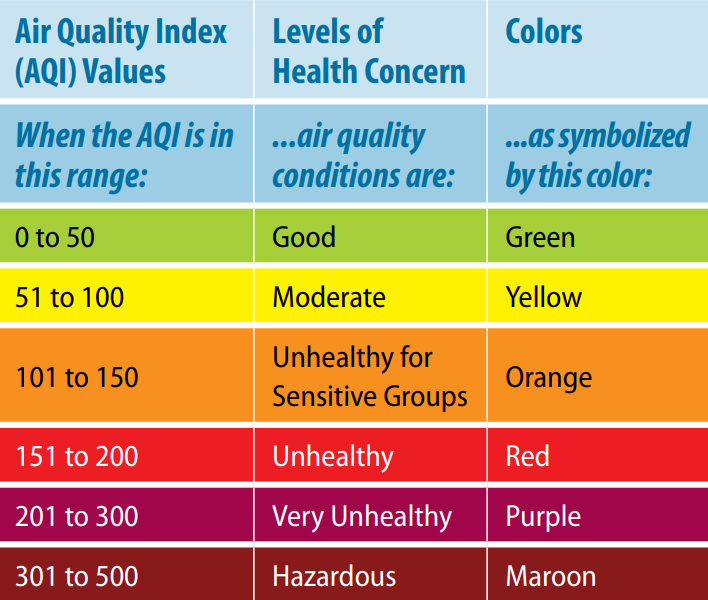

# Global Air Pollution
Which are the best cities and countries to live based on AQI values?

 

# Air Quality Index Classification
Each AQI range is related to a color and a specific classification.

 

	

 

# Air Quality Index Recommendation
Recommendations based on each relevant AQI Value

 

	

 

	

 

	

